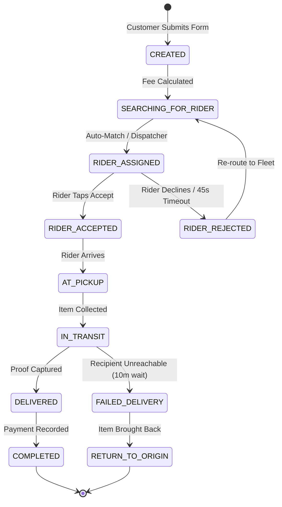
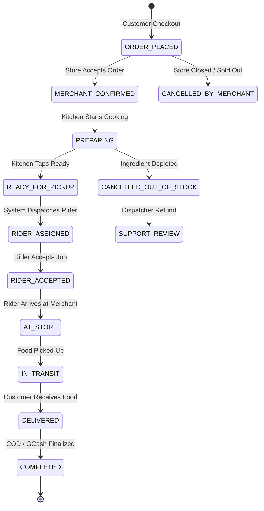

# BaaoDash — Master Business Specification & MVP Operational Blueprint

**Working Brand:** BaaoDash  
**Future Expansion Brand:** RinconaDash  
**Initial Market:** Municipality of Baao, Camarines Sur, Philippines + Contiguous Barangays  
**Business Type:** Hyperlocal Delivery Marketplace + Micro-Logistics Network  
**Operating Model:** Independent Contractor Riders + Traditional Pedicab Inclusion + Partnered Merchants + Dispatcher-Assisted Operations  
**Core Strategic Anchor:** Founder's Existing B2B Ice Supply Business (LJK Consumer Goods Trading)  
**MVP Primary Goal:** Prove sustainable daily order density and positive unit economics in Baao before geographic or technical expansion.

---

# Table of Contents
1. [Executive Summary](#1-executive-summary)
2. [Vision & Regional Roadmap](#2-vision--regional-roadmap)
3. [Brand Identity & Core Positioning](#3-brand-identity--core-positioning)
4. [Problem Statement & Local Dynamics](#4-problem-statement--local-dynamics)
5. [Target Customer Segments & Use Cases](#5-target-customer-segments--use-cases)
6. [Anchor Customer Strategy & Empirical Feasibility Study](#6-anchor-customer-strategy--empirical-feasibility-study)
7. [Service Offerings & Category Rules](#7-service-offerings--category-rules)
8. [Multi-Tier Pricing Engine & Delivery Fare Matrix](#8-multi-tier-pricing-engine--delivery-fare-matrix)
9. [Payment Architecture, COD Remittance & Float Economics](#9-payment-architecture-cod-remittance--float-economics)
10. [Financial Model, Unit Economics & Break-Even Analysis](#10-financial-model-unit-economics--break-even-analysis)
11. [Hyperlocal Field Operations & Operating Protocols](#11-hyperlocal-field-operations--operating-protocols)
12. [Philippine Regulatory, Tax & Legal Compliance Blueprint](#12-philippine-regulatory-tax--legal-compliance-blueprint)
13. [Rider Network Architecture & Lifecycle Management](#13-rider-network-architecture--lifecycle-management)
14. [Merchant Strategy, Onboarding & Kitchen Integration](#14-merchant-strategy-onboarding--kitchen-integration)
15. [End-to-End Customer Workflows](#15-end-to-end-customer-workflows)
16. [Order State Machines & Exception Protocols](#16-order-state-machines--exception-protocols)
17. [Dispatching Strategy & Operational Evolution](#17-dispatching-strategy--operational-evolution)
18. [Unified Screen Architecture & Responsive PWA Specification](#18-unified-screen-architecture--responsive-pwa-specification)
19. [Technical Architecture, Infrastructure & Stack Selection](#19-technical-architecture-infrastructure--stack-selection)
20. [Complete Database Schema (PostgreSQL / Supabase)](#20-complete-database-schema-postgresql--supabase)
21. [MVP Development Priorities & Technical Roadmap](#21-mvp-development-priorities--technical-roadmap)
22. [Solo Developer Execution Feasibility & Scope Defense](#22-solo-developer-execution-feasibility--scope-defense)
23. [Operational Staffing Milestones & Organizational Growth](#23-operational-staffing-milestones--organizational-growth)
24. [Key Business Risks, Sensitivity & Comprehensive Mitigations](#24-key-business-risks-sensitivity--comprehensive-mitigations)
25. [Go-To-Market Execution Plan (Phases 0 to 5)](#25-go-to-market-execution-plan-phases-0-to-5)
26. [Key Performance Indicators (KPIs) & Validation Milestones](#26-key-performance-indicators-kpis--validation-milestones)
27. [Comprehensive Launch Checklist & Master Assessment](#27-comprehensive-launch-checklist--master-assessment)

---

# 1. Executive Summary

BaaoDash is a purpose-built, hyperlocal on-demand delivery marketplace and micro-logistics platform designed specifically for the Municipality of Baao (Camarines Sur, 5th Congressional District, Philippines) and its contiguous barangays.

The platform coordinates four core participants:
1. **Individual Residential Customers** seeking fast, reliable delivery of food, groceries, pharmacy goods, and personal packages.
2. **Local Merchants & Small Businesses (SMBs)** (cafes, bakeries, pharmacies, groceries, hardware stores, water refilling stations, agricultural supply dealers).
3. **Independent Motorcycle Couriers** handling cross-barangay, high-urgency, and prepared food runs.
4. **Traditional Pedicab and Tricycle Drivers** integrated through an assisted dispatch system for ultra-low-cost, short-radius commodity runs.

### What BaaoDash Is Not
BaaoDash is **not** a speculative Grab or Lalamove clone. Major metro delivery platforms rely on immense urban density, 25%–30% merchant commission fees, and uniform ₱60–₱100 motorcycle minimum fares. In a provincial 4th-class municipality like Baao, that model fails immediately because standard delivery charges wipe out 100%+ of small merchant profits on local commodities and trigger severe customer cart abandonment.

### The Core Problem Solved
> **"When someone in Baao needs an item picked up, food delivered, or business supplies moved, they should be able to book a verified local rider instantly without calling 5 personal contacts on Facebook Messenger."**

### Empirical Foundation & The Ice Business Anchor
A unique structural moat of BaaoDash is its live commercial anchor: the founder’s active ice manufacturing and distribution enterprise (**LJK Consumer Goods Trading**). Grounded in verified **August 2026 operational records** (2,232.3 kg ice volume, 238 transactions, 74 deliveries, ₱18.92 average pedicab delivery cost, and ₱37.60 average net profit per delivery order), the ice business provides:
- Immediate baseline delivery volume from Day 1.
- Proof of rural willingness-to-pay.
- A predictable morning B2B route ("Milk Run") that anchors daily driver earnings before the retail lunch rush.

### Validated MVP Scope
To guarantee solo developer buildability and operational viability, the MVP strictly launches with two services:
1. **Padala / Package Courier (Priority 1):** Point-to-point parcel delivery (sender already possesses the item). Zero food spoilage risk, zero merchant inventory sync needed.
2. **Partnered Merchant Orders (Priority 2):** Food and retail ordering from 5–10 curated local merchants with synchronized kitchen preparation stages.
3. *(Strictly Deferred to V2)* **Pabili / Personal Shopping:** Prohibited during MVP to eliminate rider cash advances (*abono*), receipt disputes, missing item substitutions, and customer cancellation fraud.

---

# 2. Vision & Regional Roadmap

## 2.1 Short-Term Vision (Months 1–6)
Establish BaaoDash as the indispensable, trusted delivery utility within the Municipality of Baao. Prove positive unit economics at **30–50 completed deliveries per day** with a blended gross contribution margin of **₱9.50–₱11.00 per order**, while bridging digital motorcycle riders and offline pedicab operators into one coordinated network.

## 2.2 Medium-Term Vision: The Rinconada Logistics Corridor (Months 7–18)
Upon stabilizing Baao operations, expand outward along Highway 1 (Maharlika Highway) and adjacent provincial corridors across the **Rinconada District** (5th District of Camarines Sur), unifying an aggregate population of over 480,000 residents under the regional brand **RinconaDash**:

```
[Phase 1: Baao Proper (Poblacion & Core Barangays)]
               │
               ▼
[Phase 2: Contiguous Baao Rural Barangays & Subdivisions]
               │
               ▼
[Phase 3: Rinconada Corridor Expansion]
   ├── Nabua (Commercial Center & Academic Hub)
   ├── Iriga City (Primary Commercial City Center)
   ├── Bula (Agricultural & Food Production)
   ├── Bato (Lake Fishery & Regional Commerce)
   └── Buhi (Highland Lake Tourism & Agro-trade)
               │
               ▼
[Phase 4: Unified Regional Network: RinconaDash]
```

## 2.3 Long-Term Infrastructure Vision
RinconaDash evolves from an on-demand food courier into the **operating system for rural commerce in Bicol**, powering:
- Inter-town business logistics (e.g., Nabua restaurant sourcing supplies from Iriga, delivered through BaaoDash relay).
- Cold-chain distribution (ice, fresh meat, dairy, seafood from Lake Bato and Lake Buhi).
- Agricultural farm-to-table distribution for provincial producers.

---

# 3. Brand Identity & Core Positioning

## 3.1 Naming Architecture
- **Initial Phase:** **BaaoDash** — Instantly communicates local pride, hyper-proximity, and rapid service to Baao residents.
- **Regional Phase:** **RinconaDash** — Retains regional loyalty across the entire 5th District of Camarines Sur without feeling like an outside corporate invader.

## 3.2 Brand Taglines
- **Primary Tagline:** *Anything Local. Delivered.*
- **Bikolano / Rinconada Tagline:** *Padala. Pabili. Hatid. Sa bilog na Baao.*
- **B2B / Merchant Tagline:** *Your town’s delivery fleet — without the overhead.*

## 3.3 Core Differentiation: The Hyperlocal Moat

| Feature | Metro Apps (Grab / Foodpanda / Lalamove) | Informal Facebook Messenger Groups | BaaoDash Network |
| :--- | :--- | :--- | :--- |
| **Geographic Focus** | Tier 1/2 Cities (Naga, Legazpi); ignores Baao | Baao only, but chaotic and unorganized | 100% dedicated to Baao & Rinconada |
| **Merchant Commission** | 25% – 30% of basket value | 0% (Merchant negotiates rider) | 0% commission on food; flat delivery fee |
| **Vehicle Types** | Motorcycles and 4-wheel sedans only | Whatever friend is available | Tiered: Pedicabs, Tricycles, & Motorcycles |
| **Short-Trip Minimum Fee** | ₱60 – ₱89 minimum fare | ₱30 – ₱50 unpredictable | **₱20 – ₱25 micro-tier (Pedicab)** |
| **Traditional Driver Inclusion** | Excluded (Requires high-end smartphone & e-wallet) | Partially used, but no dispatch | **Integrated via Dispatcher Tele-Dispatch** |
| **Payment Handling** | Rigid credit card or GCash gateway | Cash only, informal abono | COD + Direct Merchant GCash + Prepaid Float |
| **Order Tracking** | GPS map (heavy data & battery drain) | "Papunta na po" (No visibility) | **Battery-friendly Reactive Stepper UI** |
| **Addressing Method** | Exact street number (Fails in rural barangays) | Descriptive text message | **3-Tier Provincial Landmark Engine** |

---

# 4. Problem Statement & Local Dynamics

In provincial municipalities like Baao, the logistics market suffers from distinct friction points:

1. **The "Message a Friend" Bottleneck:** Consumers and merchants rely on private phone numbers or Messenger chats with 2 or 3 riders. If those riders are on personal trips, asleep, or out of gas, the order is abandoned.
2. **Informal Pricing Volatility:** Without standard zones, riders quote arbitrary fees (₱50 to a neighbor, ₱80 to an unfamiliar customer), creating distrust and hesitation.
3. **The Abono Trap:** Provincial riders rarely carry more than ₱500 in working capital. Forcing riders to advance cash (*abono*) for customer store orders leads to rider refusal, delayed pickups, and ghost-order disputes.
4. **Digital Divide for Traditional Transport:** Hundreds of pedicab and tricycle drivers in Baao have bicycles or trikes but lack smartphones, high-speed data, or digital literacy. Excluding them eliminates the lowest-cost transport layer in town.
5. **Absence of Street Numbers:** Baao's barangays rely on puroks, sitios, and landmarks (e.g., *"tapat ng kapilya, may dilaw na gate"*). Standard map pins often drop riders in rice fields 500 meters from the true location.

---

# 5. Target Customer Segments & Use Cases

## 5.1 Residential & Individual Consumers
- **Working Parents & Remote Workers:** Food delivery from Poblacion cafes/eateries during working hours; emergency milk/diaper deliveries from local pharmacies.
- **Elderly & Homebound Citizens:** Prescription medicine pickup from Baao pharmacies; weekly market produce (*padala* from relatives in town).
- **Online Social Media Shoppers:** Purchasing baked goods, apparel, and crafts from home-based Baao sellers on Facebook Marketplace.

## 5.2 Small and Medium Businesses (SMBs)
- **Local Cafes, Milk Tea Shops & Restaurants:** Expanding sales radius from dine-in only to town-wide delivery without hiring dedicated delivery staff (₱300+/day salary + motorcycle maintenance).
- **Bakeries & Fast-Moving Retail:** Morning bread distribution to satellite neighborhood sari-sari stores.
- **Pharmacies & Groceries:** Dispatching pre-packaged orders to customers who called ahead.
- **Agricultural & Hardware Suppliers:** Rapid dispatch of tools, fittings, animal feeds, and fertilizers to rural barangays.

## 5.3 B2B Institutional Accounts (The Anchor Segment)
- **Ice Manufacturers (LJK Consumer Goods Trading):** Scheduled daily commercial deliveries to partner cafes, milk tea shops, and food stalls.
- **Water Refilling Stations:** Scheduled 5-gallon container deliveries along batched routes.

---

# 6. Anchor Customer Strategy & Empirical Feasibility Study

The founder’s operating business, **LJK Consumer Goods Trading**, provides verified real-world operational and financial metrics that ground this specification.

## 6.1 Empirical Baseline: August 2026 Operational Records

```
================================================================================
LJK CONSUMER GOODS TRADING — AUGUST 2026 AUDITED PERFORMANCE
================================================================================
Total Ice Volume Sold:          2,232.3 kg (Average selling price: ₱9.14 / kg)
Gross Sales Collections:        ₱20,413.00
Net Profit Margin:              43.90% (₱8,960.48 net profit | ₱4.01 / kg cushion)
Total Customer Transactions:    238 orders
  - Storefront Pickups:         164 orders (68.9% of volume)
  - Dispatched Deliveries:      74 orders (31.1% of volume | ~2.4 deliveries/day)
Average Order Basket:           9.38 kg (₱85.77 gross value)
Net Profit per Delivery Order:  ₱37.60 average profit cushion
Delivery Fee Collected (Cust):  ₱160.00 total (Only ~₱2.16 collected per trip)
Owner-Subsidized Delivery Cost: ₱1,240.00 (Business absorbed 88.6% of delivery cost)
Total Paid to Delivery Drivers: ₱1,400.00
Actual Cost per Delivery Trip:  ₱18.92 (Paid to local pedicab drivers: ₱15–₱20/trip)
================================================================================
```

## 6.2 Key Feasibility Insights & Strategic Realities

### Finding 1: Flat Motorcycle Rates (₱50–₱70) Destroy Retail Commodity Delivery
- **Profit Destruction:** An average retail ice delivery yields **₱37.60** in net profit. If the merchant subsidizes a ₱50–₱70 motorcycle fare, the business loses **₱12.40 to ₱32.40 on every delivery**.
- **Customer Refusal:** Asking a customer buying an ₱85 bag of ice to pay a ₱60 delivery fee (a 70% markup) causes immediate order cancellation. Customers will simply walk to the store (as the 164 pickup customers did) or buy inferior ice from a nearby sari-sari store.
- **Vehicle Economics:** Pedicab drivers operate without gasoline costs on flat town routes (200m–800m). Paying them **₱18–₱20 per trip** is economically viable for both driver and merchant, whereas a motorcycle burning ₱65/liter gasoline cannot operate profitably below ₱45–₱50.

### Finding 2: The Three Viable Operating Models

```
                               ┌──────────────────────────────────────────────┐
                               │   LJK ICE BUSINESS FEASIBILITY PATHWAYS      │
                               └──────────────────────┬───────────────────────┘
                                                      │
         ┌────────────────────────────────────────────┼────────────────────────────────────────────┐
         │                                            │                                            │
         ▼                                            ▼                                            ▼
┌─────────────────────────────────┐   ┌─────────────────────────────────┐   ┌─────────────────────────────────┐
│     Model 1: Micro-Zone Trike   │   │    Model 2: B2B "Milk Run"      │   │ Model 3: Value-Tier Free Delivery│
├─────────────────────────────────┤   ├─────────────────────────────────┤   ├─────────────────────────────────┤
│ • Radius: <1 km (Poblacion)     │   │ • Route: 4-5 drops in one loop  │   │ • Basket < ₱150: Customer pays  │
│ • Customer pays: ₱22            │   │ • Total Pool: ₱100 (₱25/drop)   │   │   ₱20 pedicab fee or pickups    │
│ • Pedicab gets: ₱18             │   │ • Rider gets: ₱80 (45 mins work)│   │ • Basket > ₱350 (>38 kg):       │
│ • BaaoDash retains: ₱4          │   │ • BaaoDash retains: ₱20         │   │   Merchant subsidizes delivery  │
│ • Day-1 Volume: 74 orders/month │   │ • Supplies cafes, milk teas     │   │   (₱150+ margin easily absorbs) │
└─────────────────────────────────┘   └─────────────────────────────────┘   └─────────────────────────────────┘
```

1. **Micro-Zone Pedicab Dispatch:** Formalize the existing pedicab drivers into BaaoDash's micro-tier. Customer or merchant pays ₱22; pedicab gets ₱18 (preserving their standard rate); platform takes ₱4.
2. **B2B Morning "Milk Run" (Route Batching):** Between 6:30 AM and 8:00 AM, one motorcycle or motorized tricycle carries 4 commercial drops in a single scheduled loop (e.g., Cafe A: 20 kg, Bakery B: 15 kg, Restaurant C: 25 kg, Cafe D: 15 kg). Each business pays ₱25 delivery (total pool: ₱100). The driver earns ₱80 for 45 minutes; BaaoDash retains ₱20.
3. **Threshold-Based Subsidized Delivery:** Retail orders (<₱150) pay the standard ₱20 pedicab fee. Commercial wholesale orders (>₱350) receive free delivery subsidized by the merchant, because the ₱150+ gross profit margin comfortably covers the ₱25 delivery cost.

---

# 7. Service Offerings & Category Rules

```
                      ┌────────────────────────────────────────┐
                      │        BAAODASH SERVICE MATRIX         │
                      └───────────────────┬────────────────────┘
                                          │
                  ┌───────────────────────┴───────────────────────┐
                  ▼                                               ▼
     ┌────────────────────────┐                      ┌────────────────────────┐
     │  SERVICE A: PADALA     │                      │  SERVICE B: MERCHANT   │
     │  (Point-to-Point)      │                      │  (Catalog Orders)      │
     ├────────────────────────┤                      ├────────────────────────┤
     │ • MVP Priority 1       │                      │ • MVP Priority 2       │
     │ • Sender has item      │                      │ • Partnered cafes/shops│
     │ • Instant fee preview  │                      │ • Coordinated prep     │
     │ • Direct rider dispatch│                      │ • Delayed dispatch     │
     │ • Documents / parcels  │                      │ • Food, bakery, pharma │
     └────────────────────────┘                      └────────────────────────┘
```

## 7.1 Service A — Padala / Courier (MVP Priority 1)
- **Concept:** Customer already possesses an item (parcel, document, keys, homemade food, bought item) and requests point-to-point transport.
- **Workflow:** Sender selects pickup barangay/landmark ➔ selects destination ➔ specifies package type and size ➔ fee is previewed ➔ rider accepts ➔ pickup confirmed ➔ item transported ➔ recipient confirms / proof captured ➔ payment collected.
- **Key Advantage:** Zero reliance on store inventory, zero food prep delays, zero merchant abono risk.

## 7.2 Service B — Partnered Merchant Orders (MVP Priority 2)
- **Concept:** Customer browses an authenticated digital menu/catalog from partner merchants (cafes, bakeries, pharmacies, groceries), adds items to cart, and checks out.
- **Workflow:** Order placed ➔ Merchant accepts & sets preparation timer ➔ Kitchen prepares ➔ Merchant taps "Ready for Pickup" ➔ System alerts and dispatches rider ➔ Rider arrives, verifies items, delivers, collects payment.
- **Key Advantage:** Riders do not wait unpaid outside cafes; orders are fresh upon pickup.

## 7.3 Service C — Pabili / Personal Shopping (Strictly Deferred to V2)
- **Policy:** **Strictly excluded from MVP scope.**
- **Rationale:** Non-partnered pabili requires riders to advance their personal money (*abono*), navigate unverified store prices, handle substitutions via phone calls, and face high cancellation rates. Pabili will only be considered in V2 after digital in-app escrow or verified customer credit accounts are established.

---

# 8. Multi-Tier Pricing Engine & Delivery Fare Matrix

To balance customer affordability, fair driver compensation, and platform profitability, BaaoDash enforces a **transparent, distance-and-vehicle-tiered pricing matrix**:

```
                                  FARE BREAKDOWN ARCHITECTURE
┌────────────────────────┬─────────────┬──────────────┬─────────────────┬──────────────────────┐
│ Service Tier           │ Vehicle     │ Customer Fee │ Driver Payout   │ BaaoDash Margin (Net)│
├────────────────────────┼─────────────┼──────────────┼─────────────────┼──────────────────────┤
│ Micro-Zone (<1 km)     │ Pedicab     │ ₱22.00       │ ₱18.00 (81.8%)  │ ₱4.00 (18.2%)        │
│ Poblacion Standard     │ Motorcycle  │ ₱50.00       │ ₱38.00 (76.0%)  │ ₱12.00 (24.0%)       │
│ Cross-Barangay         │ Motorcycle  │ ₱70.00       │ ₱55.00 (78.6%)  │ ₱15.00 (21.4%)       │
│ Outer Zone (>5 km)     │ Motorcycle  │ ₱100.00      │ ₱80.00 (80.0%)  │ ₱20.00 (20.0%)       │
│ B2B Morning Milk Run   │ Moto/Trike  │ ₱25.00 /drop │ ₱20.00 /drop    │ ₱5.00 /drop (20.0%)  │
│ Monsoon Rain Surcharge │ Motorcycle  │ +₱15.00      │ +₱15.00 (100%)  │ ₱0.00 (Hazard pass)  │
└────────────────────────┴─────────────┴──────────────┴─────────────────┴──────────────────────┘
```

### Zone & Geographic Coverage Rules
1. **Micro-Zone Tier (₱22.00):** Strictly limited to trips within Poblacion and adjacent streets within an 800m–1,000m radius. Reserved for pedicabs, bicycles, and walking couriers.
2. **Poblacion Standard Tier (₱50.00):** Trips originating and ending within Poblacion, San Nicolas, San Vicente, or Del Rosario handled by motorcycle for high urgency or hot food.
3. **Cross-Barangay Tier (₱70.00):** Trips between Poblacion and mid-radius rural barangays (e.g., Sta. Cruz, San Juan, Agdangan, Sagrada, May-baao, Buluang).
4. **Outer Zone Tier (₱100.00):** Distant boundary barangays or border trips toward Bula, Nabua, or Iriga boundaries (e.g., Antipolo, Cristo Rey, Tapol, Pugay).
5. **B2B Route Batching Tier (₱25.00/stop):** Available exclusively for contracted merchants scheduling 3 or more drops simultaneously during off-peak hours (6:00 AM – 8:30 AM or 1:30 PM – 3:30 PM).

---

# 9. Payment Architecture, COD Remittance & Float Economics

## 9.1 Supported Payment Instruments
- **Cash on Delivery (COD):** The dominant payment method in provincial settings (anticipated 80%+ of initial transaction volume).
- **Direct Merchant GCash:** Customer sends payment directly to the merchant's verified GCash QR/mobile number before dispatch, uploading the GCash reference number.

> [!IMPORTANT]
> **No Built-in In-App Digital Wallet for MVP:** To avoid complex Bangko Sentral ng Pilipinas (BSP) electronic money issuer (EMI) compliance, BaaoDash does not hold customer fiat balances. Instead, the platform uses an **automated prepaid rider dispatch float balance** and an **administrative merchant ledger**.

## 9.2 The Rider Prepaid Dispatch Float Mechanism

To seamlessly collect platform fees (₱4, ₱12, ₱15, or ₱20) on COD orders where the rider collects 100% of the customer's cash:

```
[Rider Tops Up ₱150 via GCash] ──► [Admin Credits Rider Float: ₱150.00]
                                                   │
                                                   ▼
                                       [Rider Completes COD Job]
                                  Customer hands ₱70 cash to Rider
                                                   │
                                                   ▼
                                   [System Automatically Deducts]
                                    ₱15.00 Platform Margin from Float
                                                   │
                                                   ▼
                                   [Rider Pocket: +₱70 cash in hand]
                                   [Float Balance: ₱135.00 remaining]
```

### Float Top-Up & Depletion Protocol
1. **Onboarding Top-Up:** Approved riders transfer an initial float credit of **₱100 to ₱200** via GCash to the BaaoDash admin.
2. **Dynamic Margin Deduction:** For every completed delivery, the rider keeps 100% of the cash fare. The system automatically debits the exact `deliveries.platform_margin` from the rider's `prepaid_float_balance`.
3. **Low-Balance Alert:** When the float falls below ₱25, the rider interface displays a prominent warning to top up via GCash.
4. **Emergency Overdraft / Grace Reserve:** If a trusted rider (>20 completed orders, 4.5+ star rating) hits ₱0 during a peak shift, the system permits an overdraft down to **-₱50.00** (up to 3 additional deliveries), preventing delivery gridlock when the rider cannot immediately stop to top up.
5. **Float Lockout:** If balance hits -₱50.00, the rider is set to `SUSPENDED_FLOAT` and cannot accept new jobs until a top-up receipt is submitted and approved by the dispatcher.

## 9.3 Merchant Settlement & "No Abono" Policy

To protect motorcycle and pedicab drivers from cash depletion:
1. **High-Value Orders (>₱300):** Customer must pay the merchant directly via GCash prior to kitchen preparation, OR dispatcher verifies the customer via a phone call. The rider only handles pickup and delivery fee collection.
2. **Small Food Orders (<₱300 COD):**
   - Partnered merchants release packaged items to verified BaaoDash riders without demanding upfront cash.
   - Upon delivery completion and COD collection, the rider remits the food subtotal back to the merchant on their return trip, OR BaaoDash guarantees the remittance at the end of the day.
3. **End-of-Day Dispatcher Reconciliation:** At 6:00 PM daily, the dispatcher runs the Settlement Ledger. Any unremitted merchant COD held by riders is settled directly via GCash to the merchant, and debited against the rider’s system balance.

---

# 10. Financial Model, Unit Economics & Break-Even Analysis

## 10.1 Order Economics Across Categories

```
┌────────────────────────────┬──────────────┬──────────────┬──────────────┬──────────────┬────────────────┐
│ Order Category             │ Basket Value │ Delivery Fee │ Driver Share │ Platform Fee │ Feasibility    │
├────────────────────────────┼──────────────┼──────────────┼─────────────────────────────┼────────────────┤
│ Retail Ice (Motorcycle)    │ ₱85.77       │ ₱70.00       │ ₱55.00       │ ₱15.00       │ UNFEASIBLE     │
│ Retail Ice (Pedicab Tier)  │ ₱85.77       │ ₱22.00       │ ₱18.00       │ ₱4.00        │ FEASIBLE       │
│ Cafe / Restaurant Food     │ ₱260.00      │ ₱50.00–₱70.00│ ₱38.00–₱55.00│ ₱12.00–₱15.00│ HIGHLY VIABLE  │
│ Pharmacy / Urgent Parcel   │ ₱320.00      │ ₱50.00       │ ₱38.00       │ ₱12.00       │ HIGH UTILITY   │
│ B2B Morning Milk Run       │ ₱1,200.00    │ ₱100.00      │ ₱80.00       │ ₱20.00       │ OPTIMAL MARGIN │
└────────────────────────────┴──────────────┴──────────────┴──────────────┴──────────────┴────────────────┘
```

## 10.2 Realistic Blended Margin per Order

In Baao, order distribution will naturally reflect a mix of vehicle tiers:
- 35% Cross-Barangay Motorcycle (₱15.00 margin)
- 30% Poblacion Motorcycle (₱12.00 margin)
- 25% Micro-Zone Pedicab (₱4.00 margin)
- 10% B2B Scheduled Milk Run Drops (₱5.00 margin per drop)

$$\text{Blended Margin} = (0.35 \times 15) + (0.30 \times 12) + (0.25 \times 4) + (0.10 \times 5) = 5.25 + 3.60 + 1.00 + 0.50 = \mathbf{₱10.35 \text{ per order}}$$

## 10.3 Pro Forma Monthly Operating Expenses (OpEx)

Operating a lean, PWA-based local delivery network requires minimal fixed overhead:

```
┌───────────────────────────────────────────────┬──────────────────────┬───────────────────────────┐
│ Expense Item                                  │ Monthly Cost (PHP)   │ Notes / Justification    │
├───────────────────────────────────────────────┼──────────────────────┼───────────────────────────┤
│ Part-Time Dispatcher Honorarium / Stipend     │ ₱5,500.00            │ 4 hrs/day peak coverage   │
│ SMS Gateway (Semaphore API @ ₱0.50/SMS)       │ ₱950.00              │ ~1,900 automated SMS      │
│ Cloud Infrastructure (Supabase Pro + Vercel)  │ ₱1,400.00            │ Database, Auth, Storage   │
│ Physical Marketing & Merchant QR Collateral   │ ₱1,200.00            │ Tarpaulins, table tents   │
│ Customer Dispute & Spillage Contingency Fund  │ ₱1,000.00            │ Merchant replacement pool │
├───────────────────────────────────────────────┼──────────────────────┼───────────────────────────┤
│ TOTAL MONTHLY OPEX BUDGET                     │ ₱10,050.00           │ Fixed operating floor     │
└───────────────────────────────────────────────┴──────────────────────┴───────────────────────────┘
```

## 10.4 Break-Even Order Volume Calculation

$$\text{Monthly Break-Even Volume} = \frac{\text{Monthly OpEx}}{\text{Blended Margin per Order}} = \frac{₱10,050}{₱10.35} \approx \mathbf{971 \text{ orders per month}}$$

$$\text{Daily Break-Even Target} = \frac{971}{30 \text{ days}} \approx \mathbf{32.4 \text{ completed orders / day}}$$

```
┌───────────────────┬───────────────────┬───────────────────┬───────────────────┬───────────────────┐
│ Metric            │ 10 Orders / Day   │ 20 Orders / Day   │ 35 Orders / Day   │ 75 Orders / Day   │
├───────────────────┼───────────────────┼───────────────────┼───────────────────┼───────────────────┤
│ Monthly Volume    │ 300 orders        │ 600 orders        │ 1,050 orders      │ 2,250 orders      │
│ Gross Margin (Mo) │ ₱3,105.00         │ ₱6,210.00         │ ₱10,867.50        │ ₱23,287.50        │
│ Monthly OpEx      │ ₱10,050.00        │ ₱10,050.00        │ ₱10,050.00        │ ₱12,500.00 (1)    │
│ Net Operating P/L │ -₱6,945.00 (Loss) │ -₱3,840.00 (Loss) │ +₱817.50 (Profit) │ +₱10,787.50 (Prof)│
│ Operational Stage │ Phase 1: Anchor   │ Phase 2: Pilot    │ Break-Even Target │ Phase 4: Expansion│
└───────────────────┴───────────────────┴───────────────────┴───────────────────┴───────────────────┘
*(1) OpEx at 75 orders/day increases to support full-time dispatcher.*
```

---

# 11. Hyperlocal Field Operations & Operating Protocols

## 11.1 TODA Alignment & Municipal Franchise Strategy
In Baao, tricycles and pedicabs belong to organized **Tricycle Operators and Drivers Associations (TODAs)** regulated by municipal ordinances. Operating an outside delivery service without coordination risks territorial disputes.
- **Special Charter Status (*Arkila*):** In Philippine transport regulations, delivery of goods is classified as a chartered special trip (*arkila*), exempt from terminal passenger line-up restrictions.
- **TODA President Engagement:** During pre-launch, the founder formally briefs the presidents of the Poblacion, San Nicolas, and San Vicente TODAs. Drivers are registered as individual contractors with association awareness.
- **Zone Boundaries:** Pedicabs operate exclusively within their registered barangay micro-zone, preventing boundary friction with motorized tricycles.

## 11.2 The 3-Tier Provincial Addressing Framework

Because rural barangays lack street numbers and standardized Google Maps coordinates, BaaoDash implements a **3-Tier Addressing Engine**:

```
┌────────────────────────────────────────────────────────────────────────┐
│               BAAODASH 3-TIER ADDRESS INPUT FRAMEWORK                  │
├────────────────────────────────────────────────────────────────────────┤
│ Tier 1: Barangay (Mandatory Dropdown)                                  │
│         [ Select Barangay: San Vicente v ]                             │
├────────────────────────────────────────────────────────────────────────┤
│ Tier 2: Purok / Sitio / Subdivision (Mandatory Selector)               │
│         [ Select Purok: Purok 4 - Riverside v ]                        │
├────────────────────────────────────────────────────────────────────────┤
│ Tier 3: Visual Landmarks & House Identity (Descriptive Text Field)     │
│         "Tapat ng tindahan ni Aling Cora, may green gate na bakal,     │
│          katabi ng malaking mangga. Hanapin si Kuya Jun."              │
└────────────────────────────────────────────────────────────────────────┘
```

## 11.3 Monsoon & Severe Weather Operating Protocol
Camarines Sur experiences regular typhoons and intense monsoon (*Habagat*) rains. During heavy rainfall:
1. **Pedicab Suspension:** When road flooding or heavy rain occurs, pedicab operations are automatically disabled in the system for driver safety.
2. **Rain Hazard Surcharge (+₱15.00):** Activated automatically by the dispatcher during rainfall.
   - **100% Passed to Rider:** The entire ₱15.00 surcharge goes directly to the active motorcycle rider equipped with rain gear and a waterproof insulated delivery box. BaaoDash retains ₱0 of the rain surcharge.
3. **Delivery SLA Extension:** Estimated delivery times automatically expand by 20 minutes across customer-facing tracking screens.

## 11.4 Merchant Packaging Standards & Spillage Liability
Provincial roads contain potholes and uneven pavement that threaten beverages and soups.
- **Mandatory Packaging Rules:** Partner cafes must use cup sealers (preferred) or cross-taped drink lids, cardboard cup divider trays, and stapled outer paper bags.
- **Insulated Box Requirement:** Motorcycle food couriers must carry an insulated thermal delivery box with internal stabilizing cup holders.
- **Spillage Fault Allocation:**
  - *Merchant Packaging Defect (e.g. untaped lid):* Merchant remakes the order at zero charge to customer or platform.
  - *Rider Transit Mishap (e.g. dropped bag):* Rider reimburses item cost via float ledger; platform issues immediate voucher to customer.
  - *Platform Guarantee:* Customer receives an immediate remake or full refund within 30 minutes; back-end fault resolution occurs between merchant and platform.

## 11.5 Return-to-Origin (RTO) Protocol
If a recipient is unreachable at the destination:
1. **10-Minute Waiting Window:** Rider must remain at the landmark for at least 10 minutes and attempt **3 phone calls** logged through the app.
2. **Dispatcher Escalation:** If unanswered, rider alerts dispatcher via one-tap SOS.
3. **Return Authorization:** Dispatcher authorizes Return-to-Origin. The rider brings the item back to the merchant/sender.
4. **Compensation:** Customer is billed the original delivery fee plus a **50% Return Transport Fee**. The driver receives both amounts; if customer fails to pay, their mobile number is blacklisted and the cost is absorbed by BaaoDash’s Contingency Reserve.

---

# 12. Philippine Regulatory, Tax & Legal Compliance Blueprint

## 12.1 Business Structure & Licensing
- **Corporate Entity:** Operates initially under the founder's registered Sole Proprietorship: **LJK Consumer Goods Trading** (DTI Certificate No. registered in Region V), with an expanded secondary business purpose for *"Courier, Logistics, and On-Demand Delivery Services"*.
- **LGU Baao Mayor's Permit:** Classified under *Logistics / Messenger Service / Domestic Freight Forwarding Agent*.
- **Barangay Business Clearance:** Registered in Poblacion, Baao.

## 12.2 BIR Tax Compliance & Revenue Regulation No. 16-2023
The Bureau of Internal Revenue (BIR) enforces **RR No. 16-2023**, imposing a **1% withholding tax** on gross remittances by electronic marketplace operators and digital financial services platforms:
- **Exemption Threshold:** Platforms are exempt from withholding the 1% tax if the gross remittance to a single merchant does not exceed **₱500,000.00 annually**, or if the merchant is a certified **Barangay Micro Business Enterprise (BMBE)**.
- **BaaoDash Implementation:** Because 100% of partner merchants in Baao operate well under the ₱500,000 threshold, BaaoDash collects Sworn Declarations of Gross Remittances from merchants upon onboarding, maintaining zero-withholding status while submitting annual BIR informational filings.

## 12.3 DOLE Labor Advisory No. 14 (Series of 2021)
To protect rider contractor status under Department of Labor and Employment (DOLE) guidelines:
- **Four-Fold Test Safeguards:** Riders maintain complete control over their working hours; can accept or reject jobs freely; can engage with other platforms; and utilize their own registered vehicles and smartphones.
- **No Exclusivity Clause:** Rider agreements explicitly state that drivers are independent contractors, not direct employees.

## 12.4 Data Privacy Act of 2012 (RA 10173)
- Customer mobile numbers and landmark details are revealed to riders exclusively during an active delivery.
- Historical recipient personal information is masked in rider logs after delivery completion.
- Automated data retention policy purges customer address landmark text after 90 days.

---

# 13. Rider Network Architecture & Lifecycle Management

## 13.1 Dual Fleet Structure: Digital vs. Assisted

```
┌──────────────────────────────────────────────┬──────────────────────────────────────────────┐
│ DIGITAL SMARTPHONE FLEET (Motorcycles)       │ ASSISTED TRADITIONAL FLEET (Pedicabs/Trikes) │
├──────────────────────────────────────────────┼──────────────────────────────────────────────┤
│ • Native PWA interface                       │ • Offline / Basic feature phone              │
│ • Self-serve job acceptance                  │ • Centralized Dispatcher voice dispatch      │
│ • Photo Proof-of-Delivery upload             │ • Recipient SMS confirmation / Phone call    │
│ • Google Maps / Waze deep link navigation    │ • Hub station phone at Baao Public Market    │
│ • In-app prepaid float management            │ • Weekly manual ledger reconciliation        │
└──────────────────────────────────────────────┴──────────────────────────────────────────────┘
```

## 13.2 Tele-Dispatch Syntax for Traditional Drivers
For pedicab drivers without smartphones stationed at the Baao Public Market hub, the dispatcher executes assignments via standard SMS or direct voice calls:

```
[SYSTEM GENERATES SMS TO DRIVER/HUB PHONE]
"BAAODASH JOB #104:
Pick: LJK Ice Depot (San Vicente)
Drop: Extraction Point (Poblacion)
Item: 2 Bags Ice
Bayad sa Driver: ₱18.00 Cash
Pakitawagan si Dispatcher kung tatanggapin."
```

Upon verbal delivery confirmation, the dispatcher updates the order to `DELIVERED` on the administrative console.

---

# 14. Merchant Strategy, Onboarding & Kitchen Integration

## 14.1 Target Initial Merchant Cohort (5–10 Strategic Partners)
- **3 Coffee Shops / Milk Tea Cafes:** (High-frequency, high-margin youth demographic — e.g. Extraction Point in Poblacion, But First Coffee in San Nicolas)
- **2 Bakeries / Pastry Shops:** (Morning breakfast demand)
- **2 Local Eateries / Fast Food:** (Lunch & dinner volume)
- **1 Community Pharmacy:** (High-utility essential deliveries)
- **1 Commercial Ice Anchor (LJK Consumer Goods):** (Predictable morning B2B volume)

## 14.2 Zero-Commission Partner Value Proposition
Unlike national platforms charging 25%–30% cuts:
- **0% Food Commission:** Merchants keep 100% of their standard menu prices.
- **No Hidden Fees:** Delivery fees are paid entirely by the end customer (or voluntarily subsidized on bulk orders).
- **Kitchen Flow Control:** The merchant dictates preparation timing; riders are dispatched only when the order is ready.

---

# 15. End-to-End Customer Workflows

## 15.1 Padala (Package Delivery) User Flow
```
1. Customer opens BaaoDash PWA (No app store install required)
   │
2. Selects "Send a Package (Padala)"
   │
3. Chooses Pickup & Dropoff Barangays + Enters Landmarks
   │
4. Selects Vehicle Tier (Pedicab for micro-radius vs Motorcycle)
   │
5. Views Instant Upfront Fare (e.g. ₱50.00 Poblacion Standard)
   │
6. Confirms Order (COD or GCash selected)
   │
7. System alerts nearby online riders / Dispatcher assigns
   │
8. Rider accepts, proceeds to pickup, confirms item collected
   │
9. Customer monitors progress via live Reactive Stepper UI
   │
10. Rider arrives at dropoff, collects COD, uploads delivery photo
   │
11. Order completed; digital receipt displayed
```

## 15.2 Merchant Food Order Flow
```
1. Customer selects "Order Food & Goods" ➔ Chooses Cafe (Extraction Point / But First Coffee)
   │
2. Browses catalog, selects items, adds notes (e.g. "Less sugar")
   │
3. Cart calculates food total + distance-based delivery fee
   │
4. Customer submits order (Direct Merchant GCash or COD)
   │
5. Merchant receives audio alert on Kitchen Live Queue PWA
   │
6. Merchant taps "Accept Order" (Sets prep time: 15 mins)
   │
7. Kitchen cooks food ➔ Taps "Mark Ready for Pickup"
   │
8. SYSTEM DISPATCHES RIDER AT THIS MOMENT (Zero rider store wait)
   │
9. Rider arrives at store, collects sealed food package
   │
10. Rider transports to customer dropoff landmark
   │
11. Customer receives food, inspects seal, completes payment
```

---

# 16. Order State Machines & Exception Protocols

To eliminate race conditions and keep operational states unambiguous, BaaoDash enforces two distinct state diagrams:

## 16.1 Padala (Package Flow) State Machine



## 16.2 Merchant Food Order State Machine



---

# 17. Dispatching Strategy & Operational Evolution

```
┌────────────────────────────────────────────────────────────────────────┐
│                   DISPATCH EVOLUTION BY ORDER VOLUME                   │
├────────────────────────────────┬───────────────────────────────────────┤
│ Volume Tier                    │ Dispatch Architecture                 │
├────────────────────────────────┼───────────────────────────────────────┤
│ Phase 1: 0–25 orders/day       │ 100% Founder Manual / Assisted Voice  │
│ Phase 2: 25–60 orders/day      │ Hybrid Auto-Suggest + 1-Click Confirm │
│ Phase 3: 60–120 orders/day     │ Proximity Broadcast to Online Fleet   │
│ Phase 4: >120 orders/day       │ Algorithmic Batched Assignment        │
└────────────────────────────────┴───────────────────────────────────────┘
```

### Why Manual Dispatch Is an Asset in Early Stage
Early-stage automated dispatch algorithms fail in provincial towns because they cannot anticipate local conditions (e.g., bridge repairs, market day street blockages, flooded puroks). A local human dispatcher provides:
- Intimate local knowledge of which drivers are reliable.
- Emotional rapport with drivers and merchants.
- Real-time judgment to resolve customer address ambiguities.

---

# 18. Unified Screen Architecture & Responsive PWA Specification

To maximize developer velocity, BaaoDash collapses redundant views into **14 unified, component-driven responsive views**:

```
                                 14 CORE RESPONSIVE VIEWS
┌───────────────────────────┬───────────────────────────┬───────────────────────────┬───────────────────────────┐
│ 1. Customer (4 Views)     │ 2. Rider (3 Views)        │ 3. Merchant (3 Views)     │ 4. Admin (4 Views)        │
├───────────────────────────┼───────────────────────────┼───────────────────────────┼───────────────────────────┤
│ • / (Marketplace Hub)     │ • /rider (Duty Board)     │ • /merchant/orders        │ • /admin/dispatch         │
│ • /store/:id (Menu Modal) │ • /rider/active (Job Run) │ • /merchant/catalog       │ • /admin/fleet (Float)    │
│ • /checkout (Slide Drawer)│ • /rider/earnings (Float) │ • /merchant/reports       │ • /admin/pricing (Zones)  │
│ • /orders (Live Stepper)  │                           │                           │ • /admin/finances (Audit) │
└───────────────────────────┴───────────────────────────┴───────────────────────────┴───────────────────────────┘
```

### Key Screen Interactions
- **`/` (Marketplace & Booking Hub):** Features a prominent segmented header toggle: `[ Order Food & Goods ]` vs. `[ Send a Package (Padala) ]`.
- **`/orders` (Reactive Stepper UI):** Status cards dynamically transition through visual steps (`Confirmed` ➔ `Kitchen Prep` ➔ `Rider on the Way` ➔ `Delivered`) without requiring full page refreshes.
- **`/rider/active`:** Clean, high-contrast mobile view with giant tap targets for gloved fingers, direct call buttons, and a prominent **"Open in Google Maps"** navigation launcher.
- **`/merchant/orders` (Kitchen Board):** High-visibility Kanban layout with web-audio chime notifications whenever an incoming order arrives.

---

# 19. Technical Architecture, Infrastructure & Stack Selection

```
┌────────────────────────────────────────────────────────────────────────┐
│                     BAAODASH TECHNICAL TOPOLOGY                        │
├────────────────────────────────────────────────────────────────────────┤
│ Client Layer:      Next.js 14 / React (TypeScript) Mobile-First PWA    │
│ Styling & Motion:  Tailwind CSS + Lucide Icons                         │
│ Backend / API:     Next.js Server Actions & Route Handlers             │
│ Database & Auth:   Supabase (PostgreSQL with Row Level Security)       │
│ Real-Time Sync:    Supabase Realtime (WebSockets) + 12s Polling Fallback│
│ File Storage:      Supabase Storage Bucket (Delivery photos, menus)    │
│ Telecommunications:Semaphore SMS API (Philippine Local Carrier Gateway)│
│ External Navigation:Google Maps / Waze Native URL Scheme Handlers      │
└────────────────────────────────────────────────────────────────────────┘
```

---

# 20. Complete Database Schema (PostgreSQL / Supabase)

The database schema provides an immutable audit trail for all orders, float balance debits, merchant settlement batches, and provincial addresses:

```sql
-- 1. USERS & ROLES
CREATE TYPE user_role AS ENUM ('CUSTOMER', 'RIDER', 'MERCHANT', 'ADMIN');
CREATE TYPE user_status AS ENUM ('ACTIVE', 'SUSPENDED', 'PENDING_VERIFICATION');

CREATE TABLE users (
    id UUID PRIMARY KEY DEFAULT gen_random_uuid(),
    role user_role NOT NULL DEFAULT 'CUSTOMER',
    name VARCHAR(120) NOT NULL,
    mobile VARCHAR(20) UNIQUE NOT NULL,
    password_hash TEXT,
    status user_status NOT NULL DEFAULT 'ACTIVE',
    created_at TIMESTAMPTZ NOT NULL DEFAULT NOW()
);

-- 2. RIDERS FLEET
CREATE TYPE vehicle_type AS ENUM ('PEDICAB', 'MOTORCYCLE', 'TRICYCLE');
CREATE TYPE online_status AS ENUM ('OFFLINE', 'ONLINE', 'ON_TRIP');

CREATE TABLE riders (
    id UUID PRIMARY KEY DEFAULT gen_random_uuid(),
    user_id UUID NOT NULL REFERENCES users(id) ON DELETE CASCADE,
    vehicle_type vehicle_type NOT NULL DEFAULT 'MOTORCYCLE',
    is_traditional BOOLEAN NOT NULL DEFAULT FALSE,
    has_smartphone BOOLEAN NOT NULL DEFAULT TRUE,
    plate_number VARCHAR(50),
    prepaid_float_balance DECIMAL(10, 2) NOT NULL DEFAULT 0.00,
    online_status online_status NOT NULL DEFAULT 'OFFLINE',
    rating_avg DECIMAL(3, 2) NOT NULL DEFAULT 5.00,
    created_at TIMESTAMPTZ NOT NULL DEFAULT NOW()
);

-- 3. RIDER FLOAT AUDIT LEDGER
CREATE TYPE float_tx_type AS ENUM ('TOP_UP', 'ORDER_MARGIN_DEBIT', 'ADMIN_ADJUSTMENT', 'EMERGENCY_OVERDRAFT');

CREATE TABLE rider_float_ledger (
    id UUID PRIMARY KEY DEFAULT gen_random_uuid(),
    rider_id UUID NOT NULL REFERENCES riders(id) ON DELETE CASCADE,
    tx_type float_tx_type NOT NULL,
    amount DECIMAL(10, 2) NOT NULL,
    balance_after DECIMAL(10, 2) NOT NULL,
    order_id UUID,
    notes TEXT,
    created_at TIMESTAMPTZ NOT NULL DEFAULT NOW()
);

-- 4. MERCHANTS
CREATE TABLE merchants (
    id UUID PRIMARY KEY DEFAULT gen_random_uuid(),
    owner_user_id UUID NOT NULL REFERENCES users(id),
    business_name VARCHAR(150) NOT NULL,
    category VARCHAR(50) NOT NULL,
    barangay VARCHAR(80) NOT NULL,
    purok_sitio VARCHAR(80) NOT NULL,
    landmarks TEXT,
    gcash_number VARCHAR(20),
    is_open BOOLEAN NOT NULL DEFAULT TRUE,
    created_at TIMESTAMPTZ NOT NULL DEFAULT NOW()
);

-- 5. MERCHANT PRODUCTS
CREATE TABLE products (
    id UUID PRIMARY KEY DEFAULT gen_random_uuid(),
    merchant_id UUID NOT NULL REFERENCES merchants(id) ON DELETE CASCADE,
    name VARCHAR(150) NOT NULL,
    description TEXT,
    price DECIMAL(10, 2) NOT NULL,
    image_url TEXT,
    is_available BOOLEAN NOT NULL DEFAULT TRUE,
    created_at TIMESTAMPTZ NOT NULL DEFAULT NOW()
);

-- 6. PROVINCIAL ADDRESSES
CREATE TABLE addresses (
    id UUID PRIMARY KEY DEFAULT gen_random_uuid(),
    user_id UUID NOT NULL REFERENCES users(id) ON DELETE CASCADE,
    label VARCHAR(50) DEFAULT 'Home',
    barangay VARCHAR(80) NOT NULL,
    purok_sitio VARCHAR(80) NOT NULL,
    landmarks TEXT NOT NULL,
    contact_person VARCHAR(120),
    contact_phone VARCHAR(20)
);

-- 7. ORDERS
CREATE TYPE order_type AS ENUM ('PADALA', 'MERCHANT_FOOD', 'B2B_SUPPLY');
CREATE TYPE order_status AS ENUM (
    'CREATED', 'ORDER_PLACED', 'MERCHANT_CONFIRMED', 'PREPARING', 
    'READY_FOR_PICKUP', 'SEARCHING_FOR_RIDER', 'RIDER_ASSIGNED', 
    'RIDER_ACCEPTED', 'AT_PICKUP', 'IN_TRANSIT', 'DELIVERED', 
    'COMPLETED', 'FAILED_DELIVERY', 'CANCELLED'
);
CREATE TYPE payment_method AS ENUM ('COD', 'DIRECT_GCASH');

CREATE TABLE orders (
    id UUID PRIMARY KEY DEFAULT gen_random_uuid(),
    order_type order_type NOT NULL,
    customer_id UUID REFERENCES users(id),
    merchant_id UUID REFERENCES merchants(id),
    status order_status NOT NULL DEFAULT 'CREATED',
    payment_method payment_method NOT NULL DEFAULT 'COD',
    subtotal DECIMAL(10, 2) NOT NULL DEFAULT 0.00,
    delivery_fee DECIMAL(10, 2) NOT NULL,
    weather_surcharge DECIMAL(10, 2) NOT NULL DEFAULT 0.00,
    total_amount DECIMAL(10, 2) NOT NULL,
    notes TEXT,
    created_at TIMESTAMPTZ NOT NULL DEFAULT NOW()
);

-- 8. ORDER ITEMS
CREATE TABLE order_items (
    id UUID PRIMARY KEY DEFAULT gen_random_uuid(),
    order_id UUID NOT NULL REFERENCES orders(id) ON DELETE CASCADE,
    product_id UUID REFERENCES products(id),
    item_name VARCHAR(150) NOT NULL,
    quantity INT NOT NULL DEFAULT 1,
    unit_price DECIMAL(10, 2) NOT NULL
);

-- 9. DELIVERIES
CREATE TYPE vehicle_tier AS ENUM ('PEDICAB_MICRO', 'MOTORCYCLE_STANDARD', 'B2B_BATCH');

CREATE TABLE deliveries (
    id UUID PRIMARY KEY DEFAULT gen_random_uuid(),
    order_id UUID NOT NULL REFERENCES orders(id) ON DELETE CASCADE,
    rider_id UUID REFERENCES riders(id),
    vehicle_tier vehicle_tier NOT NULL DEFAULT 'MOTORCYCLE_STANDARD',
    pickup_address TEXT NOT NULL,
    dropoff_address TEXT NOT NULL,
    driver_payout DECIMAL(10, 2) NOT NULL,
    platform_margin DECIMAL(10, 2) NOT NULL,
    proof_image_url TEXT,
    picked_up_at TIMESTAMPTZ,
    delivered_at TIMESTAMPTZ
);

-- 10. MERCHANT SETTLEMENT AUDIT LEDGER
CREATE TABLE merchant_settlement_ledger (
    id UUID PRIMARY KEY DEFAULT gen_random_uuid(),
    merchant_id UUID NOT NULL REFERENCES merchants(id),
    order_id UUID NOT NULL REFERENCES orders(id),
    gross_food_amount DECIMAL(10, 2) NOT NULL,
    settlement_status VARCHAR(20) NOT NULL DEFAULT 'PENDING',
    remitted_at TIMESTAMPTZ
);

-- 11. ORDER EXCEPTIONS & DISPUTES
CREATE TABLE order_exceptions (
    id UUID PRIMARY KEY DEFAULT gen_random_uuid(),
    order_id UUID NOT NULL REFERENCES orders(id),
    reported_by UUID NOT NULL REFERENCES users(id),
    reason TEXT NOT NULL,
    resolution_status VARCHAR(30) NOT NULL DEFAULT 'OPEN',
    refund_amount DECIMAL(10, 2) DEFAULT 0.00,
    created_at TIMESTAMPTZ NOT NULL DEFAULT NOW()
);
```

---

# 21. MVP Development Priorities & Technical Roadmap

```
┌────────────────────────────────────────────────────────────────────────┐
│                        MVP SPRINT PRIORITIZATION                       │
├────────────────────────────────────────────────────────────────────────┤
│ Priority 1: Core Foundation & Auth (Weeks 1–2)                         │
│             • Next.js PWA scaffold + Supabase Auth (Mobile/PW)         │
│             • Role routing: Customer, Rider, Merchant, Admin           │
├────────────────────────────────────────────────────────────────────────┤
│ Priority 2: Padala Courier & Zone Pricing Engine (Weeks 3–4)           │
│             • Point-to-point booking form with 3-tier address fields   │
│             • Fare calculator (Micro-tier ₱22 vs Motorcycle ₱50/₱70)   │
│             • In-app float debit engine (deduct ₱4/₱12/₱15 from rider) │
├────────────────────────────────────────────────────────────────────────┤
│ Priority 3: Partnered Merchant Flow & Kitchen Queue (Weeks 5–6)        │
│             • Merchant catalog & product management                    │
│             • Kitchen live board with audio chimes                     │
│             • Coordinated delayed dispatch on "Ready for Pickup"       │
├────────────────────────────────────────────────────────────────────────┤
│ Priority 4: Dispatcher Console & Proof Verification (Weeks 7–8)        │
│             • Live manual dispatch board with one-click assignment     │
│             • Camera proof upload + Dispatcher phone verification      │
│             • Daily settlement ledger export                           │
└────────────────────────────────────────────────────────────────────────┘
```

---

# 22. Solo Developer Execution Feasibility & Scope Defense

A single developer can successfully build and maintain the BaaoDash MVP by enforcing **five strict technical constraints**:
1. **No Native Mobile App Stores:** Building and compiling separate Swift (iOS) and Kotlin (Android) apps doubles maintenance overhead and subjects the launch to Apple/Google review delays. A single responsive Progressive Web App (PWA) operates seamlessly across Android and iOS browsers.
2. **No Embedded In-App Map Canvas:** Rendering interactive vector map tiles with live GPS vehicle markers consumes 40% of frontend development bandwidth and drains customer mobile data. BaaoDash uses a **Reactive Stepper UI** and deep-links directly to the rider’s native Google Maps app via standard URL schemes.
3. **No In-App Payment Gateway Integration:** Integrating PayMongo or Maya for card processing adds complex webhook listeners and compliance audits. Direct COD and manual GCash reference inputs handle 100% of MVP payments with zero code complexity.
4. **No Automated Algorithmic Dispatch Engine:** Writing vehicle routing algorithms and real-time geospatial geofences is unnecessary for 30–50 daily orders. A human dispatcher utilizing manual click-to-assign handles dispatch with superior accuracy.
5. **Strict Exclusion of Pabili:** Deferring personal shopping preserves developer time and protects initial operational capital.

---

# 23. Operational Staffing Milestones & Organizational Growth

```
┌───────────────────┬────────────────────────────────────────────┬───────────────────────────────────────┐
│ Volume Tier       │ Core Personnel                             │ Roles & Responsibilities              │
├───────────────────┼────────────────────────────────────────────┼───────────────────────────────────────┤
│ 0–20 orders/day   │ Founder Sole Operator                      │ Merchant sales, dispatch, admin       │
│ 20–50 orders/day  │ Founder + 1 Part-Time Dispatcher           │ Peak hour dispatch (11am-2pm, 5pm-8pm)│
│ 50–100 orders/day │ Founder + 1 Full-Time Dispatcher           │ Full day dispatch, float top-up audits│
│ 100+ orders/day   │ Founder + 2 Dispatchers + 1 Merchant Lead  │ Shift coverage, onboarding expansion  │
└───────────────────┴────────────────────────────────────────────┴───────────────────────────────────────┘
```

---

# 24. Key Business Risks, Sensitivity & Comprehensive Mitigations

```
┌───────────────────────────┬───────────────────────────┬──────────────────────────────────────────────┐
│ Identified Risk           │ Severity / Probability    │ Actionable Operational Mitigation            │
├───────────────────────────┼───────────────────────────┼──────────────────────────────────────────────┤
│ 1. Rider Supply Churn     │ High / Medium             │ Anchor daily morning earnings via LJK Ice    │
│    (Riders quit if idle)  │                           │ B2B Milk Runs before consumer lunch hours.   │
├───────────────────────────┼───────────────────────────┼──────────────────────────────────────────────┤
│ 2. Unviable Commodity     │ Critical / High           │ Micro-Zone Pedicab Tier (₱22 fee / ₱18 payout│
│    Economics              │                           │ preserves margins on low-ticket ice/bread).  │
├───────────────────────────┼───────────────────────────┼──────────────────────────────────────────────┤
│ 3. Informal Messenger     │ High / High               │ Offer standardized pricing, receipts, proof  │
│    Competition            │                           │ of delivery, and multi-rider availability.   │
├───────────────────────────┼───────────────────────────┼──────────────────────────────────────────────┤
│ 4. Food Spillage on Rough │ Medium / High             │ Mandatory merchant packaging rules; insulated│
│    Provincial Roads       │                           │ thermal box with cup divider requirement.    │
├───────────────────────────┼───────────────────────────┼──────────────────────────────────────────────┤
│ 5. TODA Territorial       │ Medium / Medium           │ Brief TODA leadership; classify deliveries   │
│    Friction               │                           │ as chartered special trips (*arkila*).       │
├───────────────────────────┼───────────────────────────┼──────────────────────────────────────────────┤
│ 6. Rider Float Depletion  │ Medium / High             │ Emergency overdraft buffer (-₱50.00) allows  │
│    Mid-Shift              │                           │ trusted riders to finish shifts smoothly.    │
└───────────────────────────┴───────────────────────────┴──────────────────────────────────────────────┘
```

---

# 25. Go-To-Market Execution Plan (Phases 0 to 5)

## Phase 0: The Concierge MVP (Weeks 1–2)
Before completing the web app, validate customer willingness-to-pay manually:
- Set up a designated BaaoDash Facebook Page and dispatch mobile hotline.
- Publish a standardized zone pricing graphic for Padala deliveries.
- Dispatch jobs manually to a core group of 5 verified riders via Messenger.

## Phase 1: Anchor Operations via LJK Ice (Weeks 3–4)
- Migrate the 74 monthly delivery transactions from LJK Consumer Goods Trading onto the BaaoDash platform.
- Formalize the 6:30 AM morning B2B Milk Run route serving partner cafes.

## Phase 2: Merchant Pilot Launch (Weeks 5–6)
- Onboard 5 anchor food merchants (3 cafes, 1 bakery, 1 eatery).
- Install merchant QR standees on cafe counters with introductory marketing: *"Craving this at home? Order via BaaoDash"*.

## Phase 3: Public Launch & Poblacion Activation (Weeks 7–10)
- Launch targeted community Facebook campaigns across Baao buy-and-sell groups.
- Distribute reflective BaaoDash vehicle stickers to registered riders for passive local brand exposure.

## Phase 4: Full Municipal Optimization (Months 3–6)
- Stabilize operations at **35–50 orders/day** to achieve self-sustaining operational profitability.
- Expand coverage across all 30 barangays of Baao.

## Phase 5: Rinconada Regional Expansion (Months 7+)
- Replicate the proven Baao operational playbook in Nabua, Iriga City, and Bula under the unified **RinconaDash** umbrella.

---

# 26. Key Performance Indicators (KPIs) & Validation Milestones

```
┌───────────────────────────────────────────────┬──────────────────────┬───────────────────────────┐
│ Metric / KPI                                  │ Minimum Validation   │ Expansion Validation      │
├───────────────────────────────────────────────┼──────────────────────┼───────────────────────────┤
│ Daily Completed Deliveries                    │ 10–15 orders/day     │ 50–75 orders/day          │
│ Active Partner Merchants                      │ 5 merchants          │ 15+ merchants             │
│ Active Verified Riders                        │ 5–8 riders           │ 15–20 riders              │
│ 30-Day Customer Retention / Repeat Rate       │ 25%+                 │ 40%+                      │
│ Order Cancellation Rate                       │ < 5.0%               │ < 2.5%                    │
│ Average Dispatch-to-Pickup Time               │ < 20 minutes         │ < 12 minutes              │
│ Monthly Platform Gross Margin Contribution    │ > ₱4,000 / month     │ > ₱18,000 / month         │
└───────────────────────────────────────────────┴──────────────────────┴───────────────────────────┘
```

---

# 27. Comprehensive Launch Checklist & Master Assessment

### Pre-Launch Operational Checklist
- [ ] DTI Sole Proprietorship line of business updated under LJK Consumer Goods Trading.
- [ ] Baao Municipal LGU Mayor's Permit and Barangay Clearance confirmed.
- [ ] Sworn BIR RR 16-2023 gross remittance exemption declarations signed by merchants.
- [ ] Independent contractor rider agreements printed and signed with 8 initial couriers.
- [ ] Courtesy briefing held with Poblacion and San Vicente TODA presidents.
- [ ] 100 printed merchant counter QR standees and 20 reflective rider stickers produced.
- [ ] Semaphore SMS gateway loaded with ₱1,000 initial API balance.
- [ ] 8 food couriers verified with insulated delivery boxes and rain gear.
- [ ] LJK Ice morning B2B milk run route scheduled in admin console.

### Strategic Conclusion & North Star
The viability of BaaoDash does not hinge on complex software algorithms; it hinges on **disciplined local operational alignment**. By utilizing the founder’s existing ice business to anchor baseline cash flow, respecting traditional pedicab economics for low-cost commodities, and maintaining lean PWA infrastructure, BaaoDash solves real rural transport friction while building an unassailable hyperlocal moat.

> **Master Business Vision:**  
> *"Need something delivered around Baao? BaaoDash."*  
> *"Need logistics across Rinconada? RinconaDash."*
